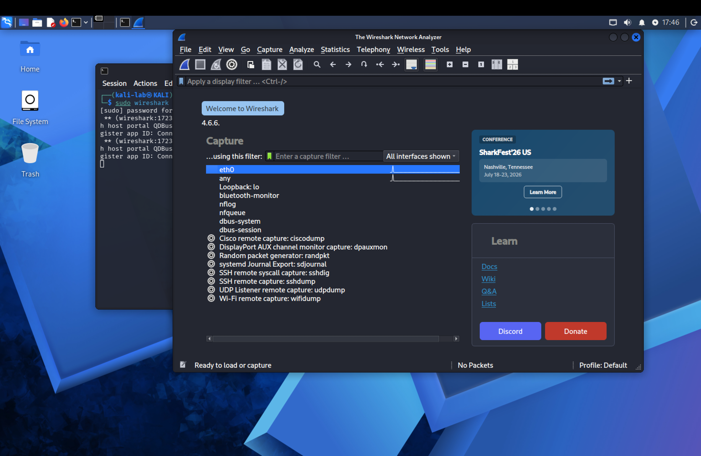
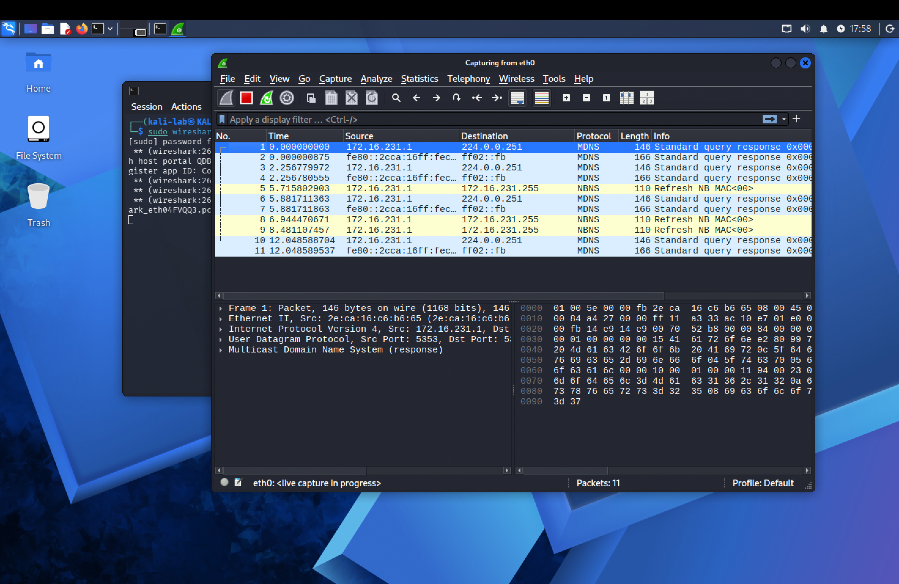
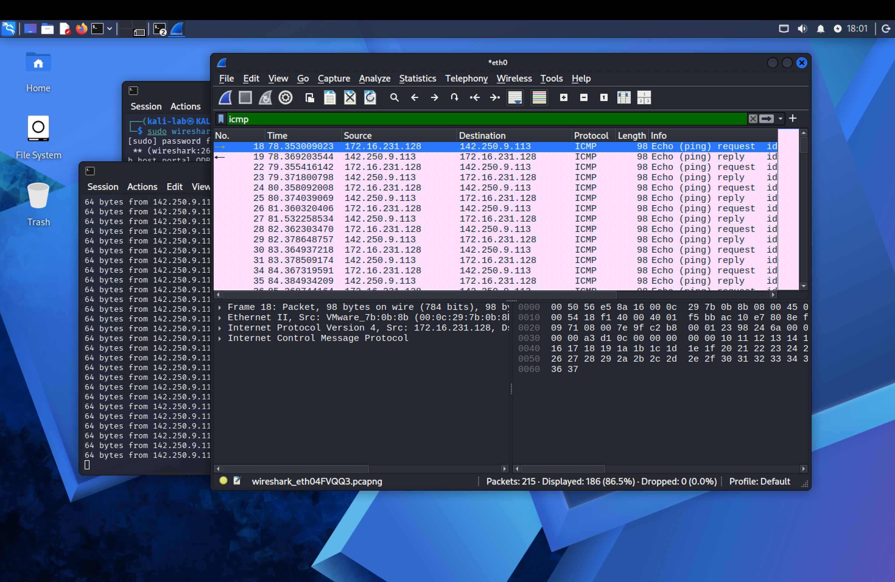
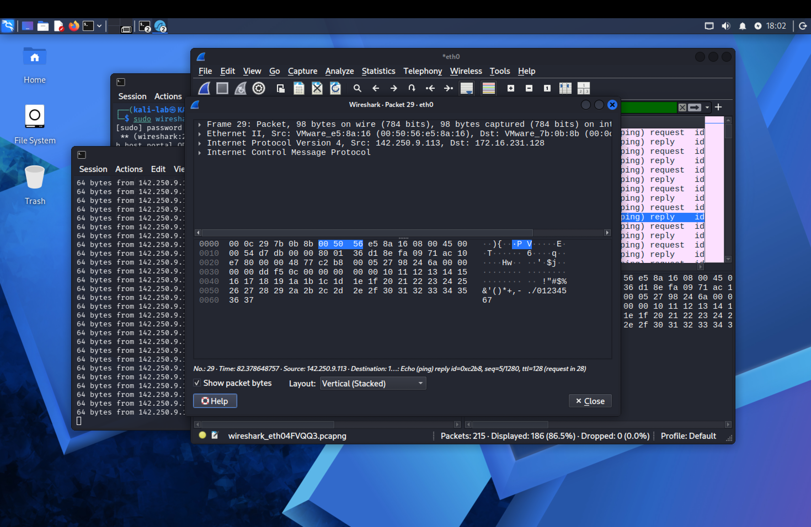
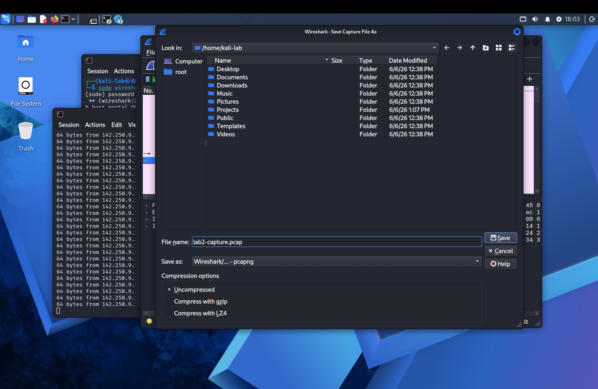

# Lab 02 — Network Traffic Analysis with Wireshark

**Date:** June 6, 2026
**Platform:** Kali Linux (VMware Fusion on macOS Apple Silicon)
**Tool:** Wireshark 4.6.6
**Difficulty:** Beginner

---

## Objective

Capture and analyze live network traffic using Wireshark on a Kali Linux VM. The goal was to understand how packets flow across a network, identify common protocols, and practice filtering traffic — core skills used daily by SOC analysts.

---

## Tools Used

| Tool | Version | Purpose |
|------|---------|---------|
| Wireshark | 4.6.6 | Packet capture and analysis |
| Terminal (Kali) | — | Generating traffic via ping |
| eth0 | — | Primary network interface |

---

## Steps Taken

### Step 1 — Launched Wireshark
Opened Wireshark from the terminal using:

```bash
sudo wireshark
```

The Wireshark welcome screen displayed all available network interfaces including `eth0`, `any`, `Loopback: lo`, `bluetooth-monitor`, and several remote capture options.

**Screenshot 1 — Wireshark Interface List:**



---

### Step 2 — Started Live Capture on eth0
Double-clicked **eth0** to begin capturing live traffic on the primary network interface.

Wireshark immediately began capturing packets. Initial traffic visible included:
- **MDNS** (Multicast DNS) — standard network discovery traffic
- **NBNS** (NetBIOS Name Service) — network naming protocol

This background traffic demonstrates that even an idle machine generates network activity — an important concept for SOC analysts distinguishing normal from suspicious traffic.

**Screenshot 2 — Live Capture Running:**



---

### Step 3 — Generated ICMP Traffic via Ping
Opened a second terminal and ran:

```bash
ping google.com
```

This generated ICMP (Internet Control Message Protocol) Echo Request and Reply packets — the most basic form of network communication verification.

**Observed:**
- Source IP: `172.16.231.128` (Kali VM)
- Destination IP: `142.250.9.113` (Google)
- Protocol: ICMP
- Packet size: 98 bytes each

**Screenshot 3 — Ping Running with Live Capture:**


---

### Step 4 — Applied ICMP Display Filter
After stopping the capture, typed the following in the Wireshark filter bar:

```
icmp
```

This filtered the capture to show only ICMP packets, isolating the ping traffic from all other background noise. A total of **215 packets captured, 186 displayed (86.5%)** after filtering.

**Screenshot 4 — ICMP Filter Applied:**



---

### Step 5 — Inspected Individual Packet Details
Clicked on a single ICMP packet to examine its full structure in the packet detail panel.

**Packet layers observed:**
- **Frame** — physical layer info (98 bytes, 784 bits)
- **Ethernet II** — MAC addresses (src/dst hardware addresses)
- **Internet Protocol Version 4** — Source: `142.250.9.113` → Destination: `172.16.231.128`
- **Internet Control Message Protocol** — Echo (ping) reply, id, sequence number, TTL: 128

This demonstrates the full OSI model in action — from physical frame to application protocol.

**Screenshot 5 — Packet Detail Inspection:**



---

### Step 6 — Saved Capture File
Saved the capture for future analysis:

```
File → Save As → lab2-capture.pcap
```

Saved to `/home/kali-lab/` as `lab2-capture.pcap` in pcapng format.

**Screenshot 6 — Save Dialog:**



---

## Key Findings

| Observation | What It Means |
|------------|---------------|
| Background MDNS/NBNS traffic on idle VM | Normal network behavior — machines constantly broadcast |
| ICMP Echo Request/Reply pairs | Successful two-way communication with google.com |
| Source IP `172.16.231.128` | VM's internal NAT IP assigned by VMware |
| Destination IP `142.250.9.113` | Google's server IP |
| TTL value of 128 | Typical Windows/server TTL — useful for OS fingerprinting |
| 215 total packets in short session | Demonstrates how much data flows in normal usage |

---

## Protocol Summary

| Protocol | Count | Description |
|---------|-------|-------------|
| ICMP | 186 (filtered) | Ping request/reply traffic |
| MDNS | Multiple | Multicast DNS — network discovery |
| NBNS | Multiple | NetBIOS Name Service |

---

## What I Learned

- How to launch Wireshark and select a network interface for capture
- How to generate specific network traffic to analyze (ping/ICMP)
- How to use Wireshark display filters to isolate specific protocols
- How to read packet details across all OSI layers
- The difference between background network noise and intentional traffic
- How to save packet captures as `.pcap` files for later analysis
- Real-world relevance: SOC analysts use these exact techniques to investigate suspicious traffic and identify anomalies

---

## SOC Relevance

Wireshark is one of the most commonly used tools in a Security Operations Center. Analysts use it to:
- Investigate alerts by examining actual packet-level traffic
- Identify data exfiltration attempts
- Detect unusual protocols or connections
- Analyze malware communication patterns
- Verify whether an alert is a true positive or false positive

---

## Next Steps

- [ ] Analyze a real-world malware PCAP from malware-traffic-analysis.net
- [ ] Practice filtering for HTTP, DNS, and TCP traffic
- [ ] Connect to TryHackMe via VPN and capture lab traffic
- [ ] Lab 03 — Nmap Network Scanning

---

*Part of an ongoing cybersecurity home lab portfolio documenting hands-on SOC analyst skill development.*
