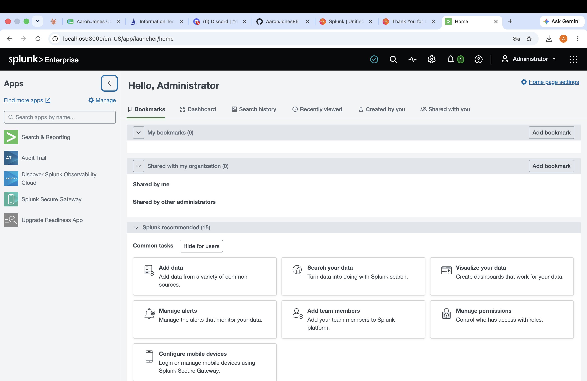
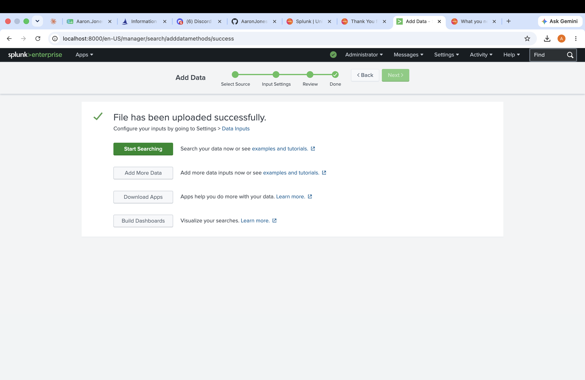
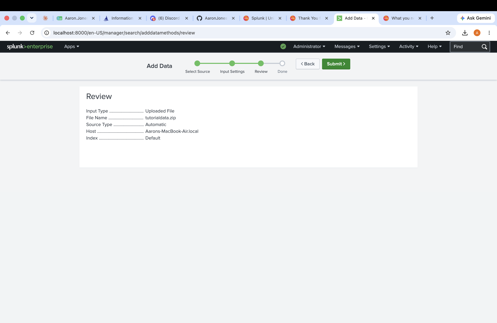
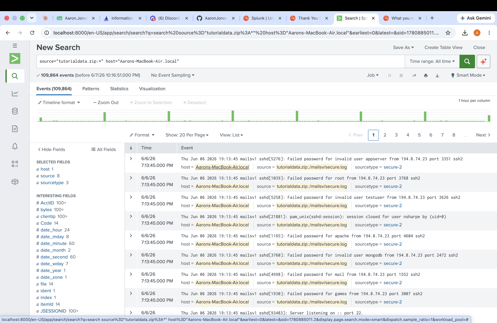
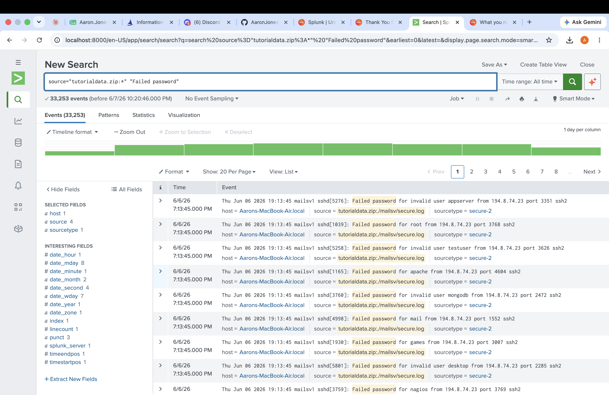
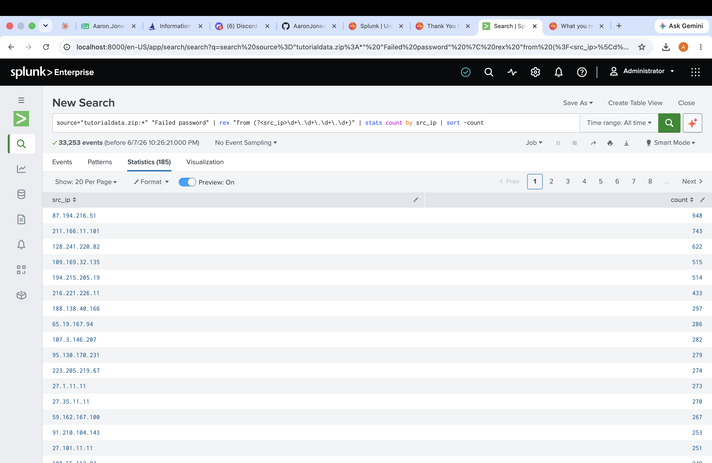
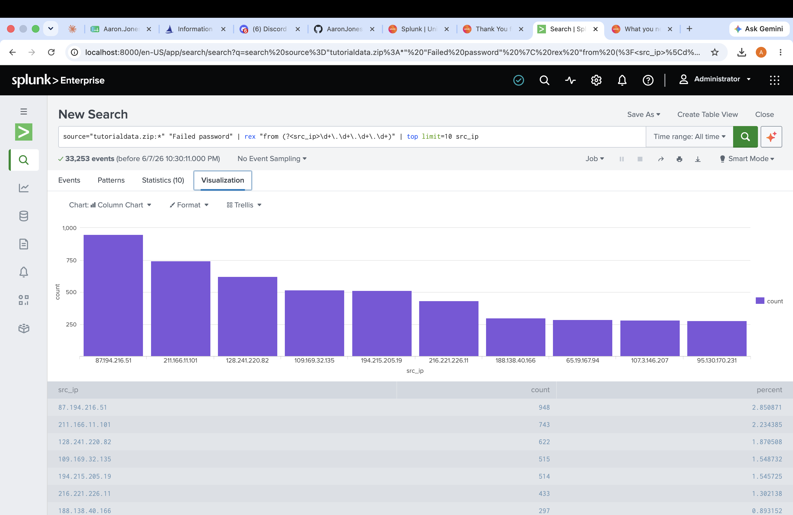

# Lab 05 — Splunk SIEM Log Analysis & Brute Force Detection

**Date:** June 7, 2026
**Platform:** Splunk Enterprise (Local install on macOS)
**Tool:** Splunk Enterprise 10.4.0
**Dataset:** Splunk Tutorial Data (tutorialdata.zip)
**Difficulty:** Intermediate

---

## Objective

Use Splunk Enterprise as a SIEM (Security Information and Event Management) tool to ingest log data, perform searches, identify security incidents, and visualize findings. This lab simulates real SOC analyst work — analyzing logs to detect a brute force SSH attack and identify the top attacking IP addresses.

---

## Tools Used

| Tool | Version | Purpose |
|------|---------|---------|
| Splunk Enterprise | 10.4.0 | SIEM platform for log ingestion and analysis |
| Splunk Tutorial Dataset | — | Sample log data including SSH, web, and security logs |
| Splunk Search Processing Language (SPL) | — | Query language for searching and analyzing data |

---

## What is a SIEM?

A SIEM (Security Information and Event Management) system collects and aggregates log data from across an organization's infrastructure — servers, firewalls, applications, and endpoints — into a central platform where security analysts can search, correlate, and alert on suspicious activity.

Splunk is one of the most widely used SIEM platforms in enterprise environments. SOC analysts use it daily to:
- Monitor security alerts in real time
- Investigate incidents by searching log data
- Identify patterns and anomalies
- Create dashboards and reports for management

---

## Steps Taken

### Step 1 — Launched Splunk Enterprise

Opened Splunk Enterprise locally at `localhost:8000` and logged in with admin credentials. The Splunk home dashboard was displayed showing available apps including Search & Reporting, Audit Trail, and Splunk Secure Gateway.

**Screenshot 1 — Splunk Enterprise Dashboard:**



---

### Step 2 — Uploaded Tutorial Data

Navigated to **Add Data → Upload** and uploaded Splunk's official tutorial dataset `tutorialdata.zip`. This dataset contains realistic sample logs including SSH authentication logs, web server logs, and security events.

**Data upload configuration:**
- Input Type: Uploaded File
- File Name: tutorialdata.zip
- Source Type: Automatic
- Host: Aarons-MacBook-Air.local
- Index: Default

**Screenshot 2 — Upload Success:**



**Screenshot 3 — Data Review Screen:**



---

### Step 3 — Initial Data Exploration

After uploading, clicked **Start Searching** to begin exploring the data. Splunk immediately indexed and displayed all events from the tutorial dataset.

**Initial search query:**
```
source="tutorialdata.zip:*" host="Aarons-MacBook-Air.local"
```

**Results:**
- **Total events indexed: 109,864**
- Sources included: mailsv/secure.log, web logs, and other system logs
- Data spans multiple days showing patterns over time
- Immediately visible: Multiple "Failed password" events in the SSH logs

**Screenshot 4 — 109,864 Events Loaded:**



**Initial Observation:** The very first events visible showed repeated "Failed password" attempts from IP `194.8.74.23` targeting multiple usernames including `appserver`, `root`, `testuser`, `apache`, `mongodb`, and `mail` — a clear indicator of a brute force attack.

---

### Step 4 — Searched for Failed Login Attempts

Ran a targeted search to isolate all failed password events:

```
source="tutorialdata.zip:*" "Failed password"
```

**Results:**
- **33,253 failed password events found**
- All events from `mailsv/secure.log` — the SSH authentication log
- Multiple usernames targeted indicating credential stuffing/brute force
- High volume over multiple days indicating sustained attack

**Screenshot 5 — 33,253 Failed Password Events:**



**Analysis:** 33,253 failed login attempts is an extremely high number indicating an automated brute force attack. In a real SOC environment this would immediately trigger a high-priority alert and require incident response.

---

### Step 5 — Identified Top Attacking IP Addresses

Used Splunk's regex extraction and stats commands to identify which IP addresses were responsible for the most failed login attempts:

```
source="tutorialdata.zip:*" "Failed password" | rex "from (?<src_ip>\d+\.\d+\.\d+\.\d+)" | stats count by src_ip | sort -count
```

**SPL Commands Used:**
- `rex` — extracts the source IP address from the log text using regex
- `stats count by src_ip` — counts events grouped by IP address
- `sort -count` — sorts results highest to lowest

**Results — Top 10 Attacking IPs:**

| Rank | IP Address | Failed Attempts |
|------|-----------|----------------|
| 1 | 87.194.216.51 | **948** |
| 2 | 211.166.11.101 | 743 |
| 3 | 128.241.220.82 | 622 |
| 4 | 109.169.32.135 | 515 |
| 5 | 194.215.205.19 | 514 |
| 6 | 216.221.226.11 | 433 |
| 7 | 188.138.40.166 | 297 |
| 8 | 65.19.167.94 | 286 |
| 9 | 107.3.146.207 | 282 |
| 10 | 95.130.170.231 | 279 |

**Total unique attacking IPs: 185**

**Screenshot 6 — Top Attacking IPs Table:**



---

### Step 6 — Visualized Attack Data

Created a bar chart visualization showing the top 10 attacking IP addresses:

```
source="tutorialdata.zip:*" "Failed password" | rex "from (?<src_ip>\d+\.\d+\.\d+\.\d+)" | top limit=10 src_ip
```

Clicked the **Visualization** tab to render the data as a column chart showing attack volume by IP address.

**Screenshot 7 — Attack Visualization Chart:**



---

## Security Findings & Analysis

### Incident Summary: SSH Brute Force Attack

| Finding | Detail |
|---------|--------|
| Attack Type | SSH Brute Force / Credential Stuffing |
| Total Failed Attempts | 33,253 |
| Unique Attacking IPs | 185 |
| Top Attacker | 87.194.216.51 (948 attempts) |
| Target Usernames | root, apache, mongodb, mail, testuser, appserver, games, desktop, nagios |
| Log Source | mailsv/secure.log (SSH authentication log) |
| Severity | High |

### SOC Analyst Response Actions
In a real SOC environment the following actions would be taken:

1. **Immediate** — Block top attacking IPs at the firewall
2. **Short term** — Review if any login attempts succeeded (look for "Accepted password" events)
3. **Investigation** — Geolocate attacking IPs to identify origin country
4. **Remediation** — Implement fail2ban or similar to auto-block brute force attempts
5. **Documentation** — Create formal incident report
6. **Escalation** — If any successful logins found, escalate to Tier 2 analyst

---

## SPL Queries Used

| Query | Purpose |
|-------|---------|
| `source="tutorialdata.zip:*"` | Search all tutorial data |
| `"Failed password"` | Filter for failed login events |
| `rex "from (?<src_ip>...)"` | Extract IP addresses using regex |
| `stats count by src_ip` | Count events per IP |
| `sort -count` | Sort highest to lowest |
| `top limit=10 src_ip` | Show top 10 IPs |

---

## What I Learned

- How to install and configure Splunk Enterprise locally
- How to ingest log data into Splunk from an uploaded file
- How to use SPL (Search Processing Language) to search and filter events
- How to use `rex` to extract fields from unstructured log data
- How to use `stats`, `sort`, and `top` commands for data aggregation
- How to create visualizations from search results
- How to identify a brute force attack from SSH authentication logs
- The SOC analyst workflow for investigating and responding to security incidents
- Why SIEM tools are essential for enterprise security monitoring

---

## Key Concepts

**Brute Force Attack:** An automated attack where an attacker tries thousands of username/password combinations hoping to guess valid credentials.

**SIEM:** Security Information and Event Management — a platform that aggregates and analyzes security log data from across an organization.

**SPL:** Splunk Processing Language — the query language used to search and analyze data in Splunk.

**IOC (Indicator of Compromise):** Evidence that a security incident has occurred. In this lab the IOCs were the attacking IP addresses and high volume of failed login attempts.

---

## Next Steps

- [ ] Lab 06 — Malware Traffic Analysis with Wireshark
- [ ] Investigate whether any brute force attempts succeeded using `"Accepted password"` search
- [ ] Practice creating Splunk dashboards and alerts
- [ ] Explore Splunk's free training at training.splunk.com

---

## References

- [Splunk Documentation](https://docs.splunk.com)
- [Splunk SPL Reference](https://docs.splunk.com/Documentation/Splunk/latest/SearchReference)
- [Splunk Free Training](https://www.splunk.com/en_us/training/free-courses/overview.html)

---

*Part of an ongoing cybersecurity home lab portfolio documenting hands-on SOC analyst skill development.*
